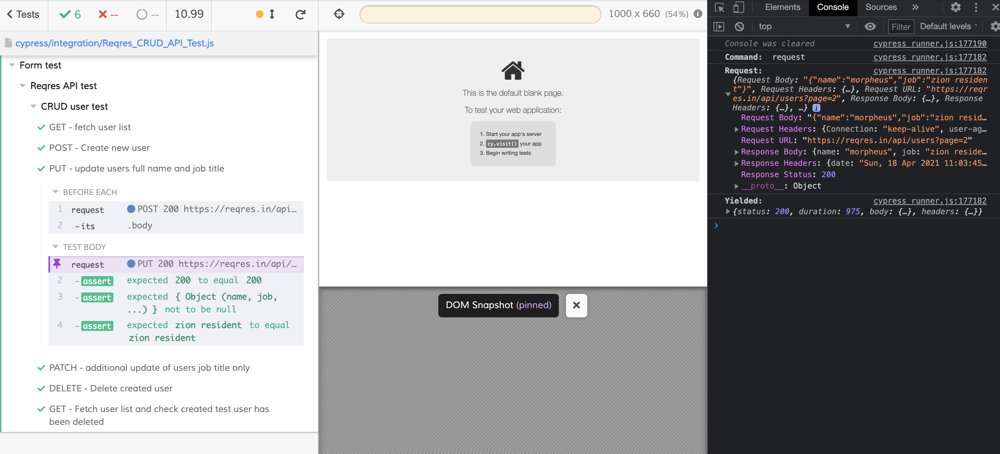

# cypress-reqris-api-testing

> [Cypress](https://cypress.op) Cypress is a next generation JS testing framework built for the modern web.

Cypress test runner GUI: 

I've created a public Dashboard with all test run stats here: https://dashboard.cypress.io/projects/o8cz1j/analytics/runs-over-time

## Installation:

Install dependencies with `npm install` or `npm ci`

See scripts in `package.json` for the complete list. 

* `npm run cy:open` - runs Cypress in GUI mode
* `npm test` - starts the local API server and runs Cypress tests against it in headless mode
